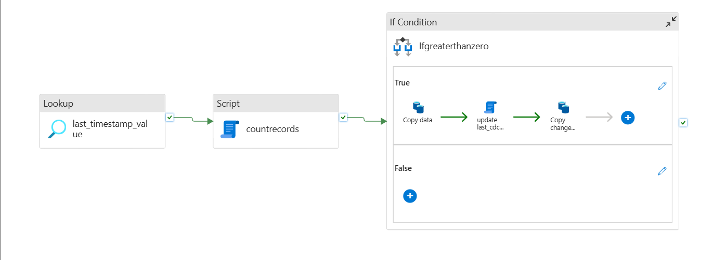
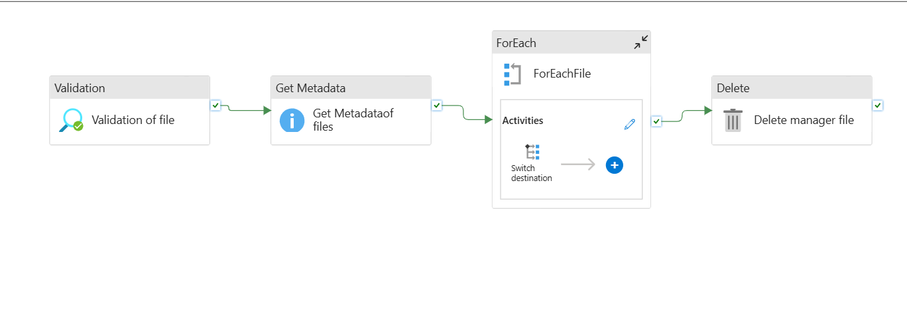

# adf-pro-real-time-Pipelines
Pipeline 1)
1) Implemented incremental data ingestion using CDC timestamps and optimized pipeline execution by leveraging Script Activity to trigger downstream processes only       when new records were available.
2) Pipeline architecture is
   

pipeline 2)
1)The pipeline copies source files to multiple destinations only when the manager uploads a file. If no file is uploaded, the entire pipeline will not run.
   use validation,metadata activity,For Each activity,switch and copy activity
   
